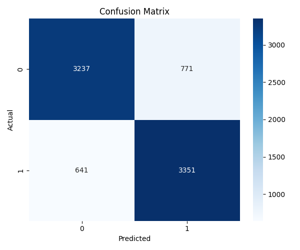

# Privacy Risk Assessment for Record Linkage Models via Membership Inference Attacks

**COMP3850 PACE Capstone Project — Data Science & Cybersecurity**  
Macquarie University · Group 61 · 2025

## 1. Project Overview

Machine learning systems trained on sensitive data can leak information about the records used during training. This project investigates that risk in a privacy-preserving record linkage setting by testing whether an attacker can infer if a particular record was part of a model's training data.

The project combines **record linkage**, **deep learning**, and **membership inference attacks (MIA)** to evaluate both predictive performance and privacy resilience.

## 2. Problem Statement

The central question was:

> Can a record linkage model perform accurately while resisting membership inference attacks that attempt to identify which records were used for training?

The system was evaluated in a controlled research setting using synthetic/de-identified data only.

## 3. Technical Approach

### Target model

A **Siamese Autoencoder** was used to compare paired 768-dimensional BERT embeddings. The encoder compressed each embedding from **768 → 256 → 50 dimensions**, with a calibrated logistic-regression head used for the linkage decision. A raw-difference **MLP classifier** was also evaluated as a comparison model.

### Shadow-model attack pipeline

To simulate a realistic attacker:

1. Shadow models were trained on disjoint data partitions to approximate the target model's behaviour.
2. Member and non-member outputs were collected.
3. Attack features were derived from model outputs, including confidence, entropy, margins, and posterior probabilities.
4. Logistic Regression and Random Forest attack classifiers were trained to infer membership.
5. Attack performance was compared with random guessing using ROC-AUC and F1.

## 4. Evaluation

The project measured both **utility** and **privacy**.

| Metric | Target Model | Membership-Inference Attack |
|---|---:|---:|
| ROC-AUC | 0.89 | ~0.50 |
| Accuracy | 87.3% | 51.1% |
| F1 Score | 0.87 | ~0.50 |

The attack AUC remained close to **0.50**, equivalent to random guessing under this experimental configuration. This indicated that the evaluated target model showed no measurable membership leakage while maintaining strong linkage performance.

The project used a privacy release gate of **target AUC ≥ 0.85** and **attack AUC < 0.55**.

### Raw-difference MLP result



The held-out MLP classifier achieved approximately **82% accuracy** on the linkage classification task.

## 5. Repository Structure

```text
privacy-risk-ml-capstone/
├── README.md
├── notebooks/
│   └── privacy_risk_mia_pipeline.ipynb
├── models/
│   ├── snn_classifier_model.keras
│   ├── mlp_raw_diff_classifier.keras
│   ├── target_encoder.keras
│   ├── target_head.joblib
│   ├── shadow_encoder.keras
│   ├── shadow_head.joblib
│   ├── attack_lr.joblib
│   └── attack_scaler.joblib
├── results/
│   ├── confusion_matrix.png
│   ├── final_test_predictions_raw_mlp.csv
│   ├── metrics.json
│   ├── attack_per_record.csv
│   ├── attack_per_record_on_target.csv
│   ├── p_trg_in.npy
│   └── p_trg_out.npy
└── requirements.txt
```

## 6. Tech Stack

- Python
- TensorFlow / Keras
- scikit-learn
- pandas
- NumPy
- Jupyter Notebook
- BERT embeddings
- Logistic Regression
- Random Forest
- Multi-Layer Perceptron
- Siamese Neural Networks

## 7. My Contribution

This was a six-person PACE capstone project spanning the Data Science and Cybersecurity streams.

My work focused on the **machine-learning and evaluation components** of the project. I worked with a teammate to fix and validate the core MVP notebook pipeline, including model-training and evaluation cells, reviewed experiment outputs, contributed to the membership-inference attack design, and helped document and interpret the final model-evaluation results.

## 8. Key Takeaways

- Strong predictive performance does not automatically imply strong privacy risk.
- Shadow-model attacks provide a practical way to evaluate model membership leakage.
- Reproducible experiments require fixed splits, environment tracking, model artifacts, and repeatable evaluation metrics.
- Privacy testing should be treated as part of an ML model's evaluation lifecycle rather than an afterthought.

## 9. Limitations

- The project used synthetic/de-identified data and pre-computed BERT embeddings rather than production clinical data.
- Results apply to the tested model architecture, splits, and attack configuration only.
- An attack AUC near random guessing does not prove that the model is immune to all privacy attacks.

## 10. Future Improvements

- Evaluate stronger and more diverse membership-inference attacks.
- Test differential privacy and additional regularisation strategies.
- Add automated experiment tracking with MLflow or Azure Machine Learning.
- Deploy the evaluation workflow as a reproducible cloud-based pipeline.
- Compare privacy/utility trade-offs across additional model families.

## Ethics & Data Handling

No raw personal or identifiable patient data is included in this repository. The university project used synthetic or de-identified research data in a controlled scope. Large source datasets are intentionally excluded from this public portfolio repository.
